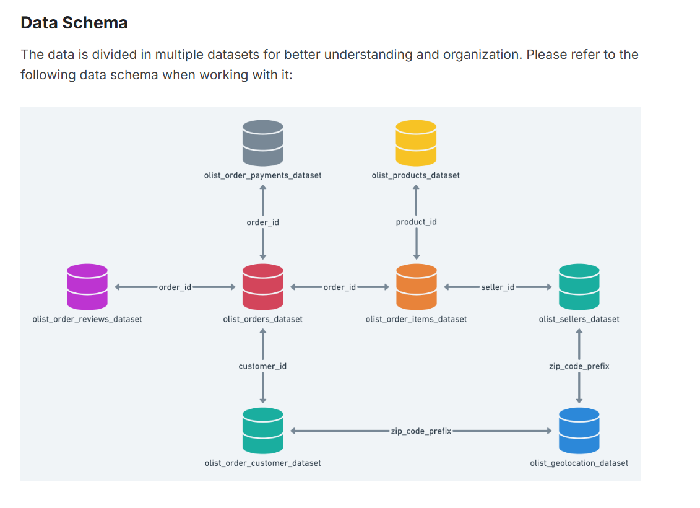
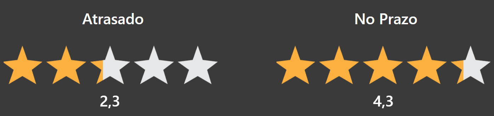
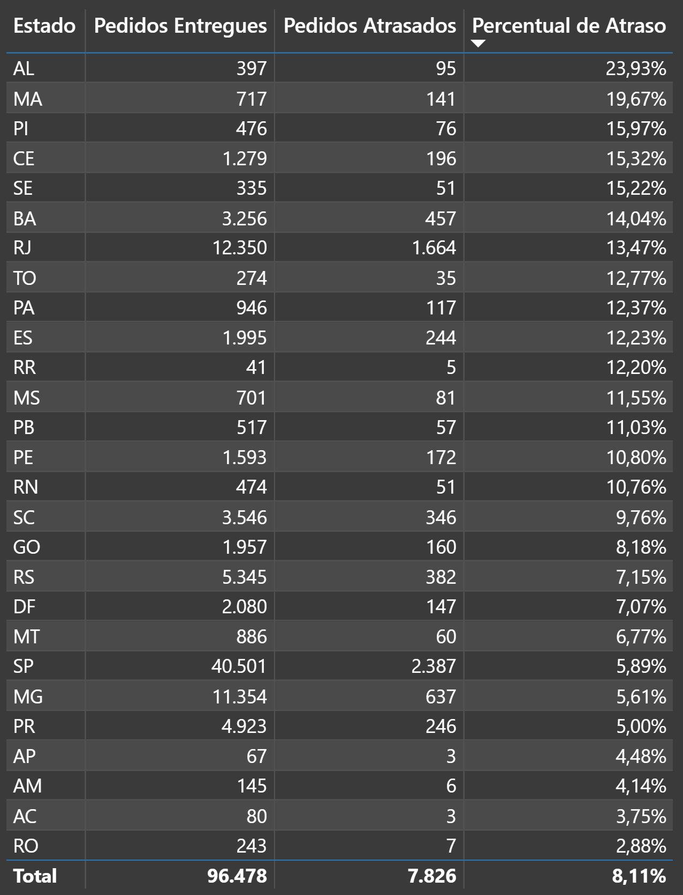
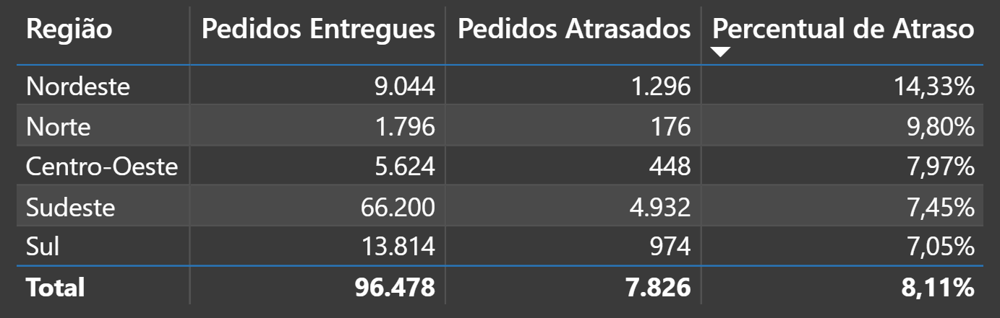
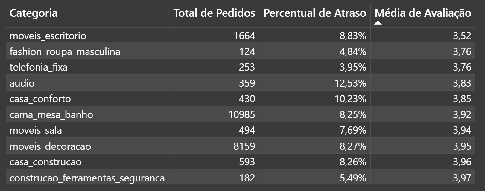
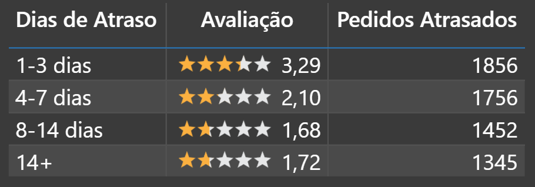

# Olist — Impacto da Performance Logística na Satisfação do Cliente

## Sobre o Projeto

Terceiro projeto do portfólio de análise de dados e o primeiro construído sobre dados reais, a partir da base pública da Olist, um e-commerce brasileiro. Os dados cobrem pedidos entregues entre 2016 e 2018. É também o primeiro projeto combinando SQL Server (SSMS) para extração e tratamento dos dados com Power BI para a construção dos visuais.

**Pergunta central:** como a performance logística impacta a satisfação do cliente no e-commerce brasileiro?

A pergunta foi dividida em cinco partes, em progressão lógica: o tamanho do problema, a relação entre atraso e nota, a distribuição regional do atraso, a concentração por categoria de produto e a influência do tamanho do atraso na nota.

Diferente dos dois projetos anteriores deste portfólio (Contoso e Adventure Works, ambos com dados fictícios da Microsoft), a base da Olist traz inconsistências reais como nulos e distorções de volume, que exigem tratamento explícito antes da análise.

---

## Modelagem e Tratamento dos Dados

A Olist disponibiliza 9 tabelas relacionadas entre si. Deste conjunto, cinco foram utilizadas para testar a relação entre logística e satisfação:

- `olist_orders_dataset` — tabela central, com datas de compra, aprovação, entrega e estimativa de entrega
- `olist_order_reviews_dataset` — nota de avaliação do pedido
- `olist_order_items_dataset` — ligação entre pedido e produto
- `olist_products_dataset` — categoria do produto
- `olist_customers_dataset` — estado do cliente

`olist_sellers_dataset`, `olist_geolocation_dataset` e `olist_order_payments_dataset` ficaram fora do escopo por não fazerem parte da relação investigada (logística e satisfação). `product_category_name_translation` foi baixada mas não utilizada, já que as categorias já vêm em português na tabela de produtos.

**Tratamento aplicado:**
- Produtos sem `product_category_name` cadastrado foram excluídos das análises que dependiam dessa informação
- Categorias com poucos pedidos distorciam a média de avaliação e geravam ruído estatístico no ranking (uma categoria tinha apenas 2 pedidos). Resolvido com `HAVING COUNT(*) >= 50`, corte justificado pela observação da distribuição real de volume por categoria

Trabalhar com dado real, e portanto sujo, foi tratado como parte do processo analítico, não como obstáculo a esconder. As decisões de tratamento estão documentadas ao longo deste README e no artigo publicado.


---

## As Perguntas da Análise

1. Qual o percentual de pedidos entregues com atraso?
2. Pedidos com atraso têm avaliação média menor do que pedidos no prazo?
3. Quais estados têm maior taxa de atraso?
   - **3.5** — Como o atraso se distribui entre as regiões do Brasil? (extra, motivado pela concentração de estados nordestinos no topo do ranking da pergunta 3)
4. Quais categorias de produto concentram as piores avaliações? (versão enriquecida, cruzando categoria, volume de pedidos, percentual de atraso e nota, para não confundir baixo volume com problema real)
5. Quanto o tamanho do atraso influencia a nota?

---

## Principais Achados

Dos 96.478 pedidos entregues na base, 7.826 chegaram com atraso, o equivalente a 8,11%. Uma fatia pequena da operação, mas relevante dado o volume de vendas de um marketplace como a Olist.

A diferença de nota entre pedidos atrasados e no prazo é grande: 2,3 contra 4,3 estrelas. Esse número usa o critério de dia completo (`DATEDIFF` em dias), não a comparação exata de datetime, por refletir melhor a percepção do cliente: a maioria das transportadoras comunica apenas a data prevista, sem horário, então um atraso de poucas horas no mesmo dia dificilmente é percebido como atraso real. Já as perguntas 1 e 3 usam o critério técnico (datetime completo), por avaliarem o cumprimento formal do prazo, uma questão operacional distinta da percepção do cliente.

A distribuição geográfica do atraso segue um padrão nítido. Alagoas lidera com 23,93%, seguido por Maranhão, Piauí, Ceará e Sergipe, todos no Nordeste. São Paulo, com o maior volume de pedidos da base (40.501), tem taxa de apenas 5,89%. Por região, o Nordeste concentra 14,33% de atraso, quase o dobro do Sul (7,05%) e do Sudeste (7,45%). Olhar o Sudeste como bloco único, porém, esconde uma exceção relevante: o Rio de Janeiro, isoladamente, tem taxa de 13,47%, próxima da média nordestina, mesmo sendo o segundo estado em volume de pedidos da base e estando próximo dos maiores centros logísticos do país. É São Paulo e Minas Gerais que puxam a média da região para baixo.

```dax
Regiao = 
SWITCH(
    TRUE();
    'Consulta3'[Estado] IN {"AL"; "BA"; "CE"; "MA"; "PB"; "PE"; "PI"; "RN"; "SE"}; "Nordeste";
    'Consulta3'[Estado] IN {"DF"; "GO"; "MS"; "MT"}; "Centro-Oeste";
    'Consulta3'[Estado] IN {"ES"; "MG"; "RJ"; "SP"}; "Sudeste";
    'Consulta3'[Estado] IN {"PR"; "RS"; "SC"}; "Sul";
    'Consulta3'[Estado] IN {"AC"; "AM"; "AP"; "PA"; "RO"; "RR"; "TO"}; "Norte"
)
```

Na análise por categoria, o percentual de atraso não explica sozinho a nota. Categorias como áudio (12,53% de atraso) e casa_conforto (10,23%) têm nota baixa associada ao atraso alto. Mas fashion_roupa_masculina (4,84%) e telefonia_fixa (3,95%) têm atraso baixo e ainda assim aparecem entre as piores avaliações, sugerindo que existe pelo menos mais um fator de insatisfação além da entrega, ligado ao próprio produto ou categoria.

Por fim, o tamanho do atraso importa, mas não de forma proporcional. A nota cai de 3,29 (1 a 3 dias) para 2,10 (4 a 7 dias), a maior queda entre faixas consecutivas, chegando a 1,68 (8 a 14 dias) e se estabilizando em 1,72 (14 dias ou mais). O volume de pedidos é semelhante entre as faixas (1.345 a 1.856), o que descarta a hipótese de que atrasos longos sejam exceção dentro da base. Esse é um dos achados mais relevantes da análise: atrasos de duas semanas ou mais não são casos isolados, eles ocorrem com frequência próxima à dos atrasos curtos, o que aponta para um problema logístico mais estrutural do que pontual, e não apenas uma cauda estatística de imprevistos raros.

---

## Considerações Técnicas

- `AVG` sobre coluna inteira trunca decimais no SQL Server: `AVG(review_score)` sem CAST retorna valor inteiro, escondendo a variação real das médias. Corrigido com `AVG(CAST(review_score AS DECIMAL(3,2)))`
- SQL Server não aceita alias no `GROUP BY`/`ORDER BY` (diferente de PostgreSQL ou Databricks): é necessário repetir a expressão completa
- A ordenação alfabética padrão do Power BI quebrava a sequência lógica das faixas de atraso ("1-3 dias", "14+", "4-7 dias"). Resolvido com uma coluna auxiliar de ordem numérica criada via Power Query (Coluna Condicional), já que uma coluna DAX equivalente gerava dependência circular

---

## Estrutura do Artigo

O artigo segue o formato pergunta por pergunta: pergunta em destaque, consulta SQL, visual e interpretação.

- **Pergunta 1** — Percentual de pedidos entregues com atraso
  
- **Pergunta 2** — Nota média: atrasado vs. no prazo
  
- **Pergunta 3** — Percentual de atraso por estado
  
- **Pergunta 3.5** — Percentual de atraso por região
  
- **Pergunta 4** — Categoria, volume, atraso e nota
  
- **Pergunta 5** — Faixas de dias de atraso × nota
  

O Power BI foi utilizado como gerador de visuais estáticos para o artigo, não como dashboard interativo publicado.

---

## Ferramentas Utilizadas

SQL Server (SSMS), Power BI, Ideogram e PIL (edição da imagem de capa)

---

## Links

📄 [Artigo completo no LinkedIn:] (https://www.linkedin.com/pulse/o-que-os-dados-da-olist-revelam-sobre-atraso-na-entrega-cruvinel-40w5f/)

---

Confira outros projetos do meu portfólio no [GitHub](https://github.com/GuilhermeCruvinel96)
